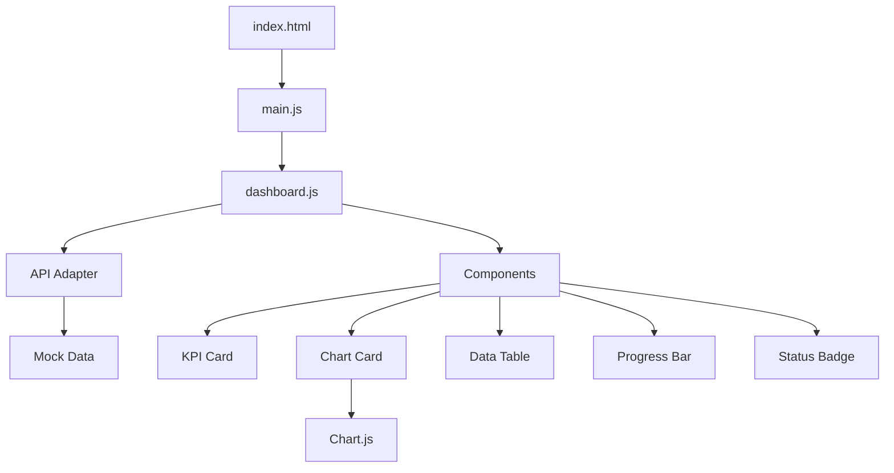

# Design Document

## Overview

Restaurant Dashboard, Vite + Vanilla JS + Tailwind CSS + Chart.js teknolojileri kullanılarak geliştirilecek frontend-only bir yönetim paneli uygulamasıdır. Uygulama, mock veri ile çalışır ve gelecekte backend entegrasyonu için hazır bir adapter katmanı içerir. Tasarım, modern, minimal ve kullanıcı dostu bir arayüz sunar.

## Architecture

### Technology Stack

- **Build Tool**: Vite (vanilla template)
- **Styling**: Tailwind CSS + PostCSS + Autoprefixer
- **Charting**: Chart.js
- **JavaScript**: Vanilla JS (ES6+)
- **Theme**: Light mode only

### Project Structure

```
restaurant-dashboard/
├── index.html                 # Ana HTML dosyası
├── package.json
├── vite.config.js
├── tailwind.config.js
├── postcss.config.js
├── public/
│   └── icons/                 # İkon dosyaları (opsiyonel)
└── src/
    ├── main.js                # Uygulama başlangıç noktası
    ├── styles.css             # Tailwind direktifleri ve özel stiller
    ├── api/
    │   ├── api.mock.js        # Mock veri kaynağı
    │   └── api.adapter.js     # API soyutlama katmanı
    ├── components/
    │   ├── kpi-card.js        # KPI kartı komponenti
    │   ├── progress-bar.js    # İlerleme çubuğu komponenti
    │   ├── chart-card.js      # Grafik kartı komponenti
    │   ├── data-table.js      # Veri tablosu komponenti
    │   └── status-badge.js    # Durum etiketi komponenti
    ├── views/
    │   └── dashboard.js       # Dashboard görünümü
    └── ui/
        ├── modal.js           # Modal yardımcısı (opsiyonel)
        └── toast.js           # Toast bildirimi (opsiyonel)
```

### Architecture Diagram



## Components and Interfaces

### 1. KPI Card Component

**Purpose**: Anahtar performans göstergelerini görselleştirir.

**Interface**:
```javascript
// src/components/kpi-card.js
export function createKpiCard(config) {
  // config: { title, value, percentage, progress, variant }
  // variant: 'dark' | 'light'
  // Returns: HTMLElement
}
```

**Features**:
- Dark ve light varyantları
- Progress bar entegrasyonu
- İkon desteği (opsiyonel)
- Responsive tasarım

### 2. Progress Bar Component

**Purpose**: Yüzdelik ilerleme gösterir.

**Interface**:
```javascript
// src/components/progress-bar.js
export function createProgressBar(config) {
  // config: { percentage, color, height }
  // color: 'purple' | 'black' | 'gray' | 'pink'
  // Returns: HTMLElement
}
```

**Features**:
- Pastel renk desteği
- Animasyonlu dolum
- Özelleştirilebilir yükseklik

### 3. Chart Card Component

**Purpose**: Grafikleri kart içinde gösterir.

**Interface**:
```javascript
// src/components/chart-card.js
export function createChartCard(config) {
  // config: { title, chartType, data, periods, onPeriodChange }
  // chartType: 'line' | 'bar'
  // periods: ['Monthly', 'Weekly', 'Today']
  // Returns: { element: HTMLElement, updateChart: Function }
}
```

**Features**:
- Chart.js entegrasyonu
- Period switcher (Monthly/Weekly/Today)
- Dinamik veri güncelleme
- Responsive canvas

### 4. Data Table Component

**Purpose**: Tablo formatında veri gösterir.

**Interface**:
```javascript
// src/components/data-table.js
export function createDataTable(config) {
  // config: { columns, data, onRowClick }
  // columns: [{ key, label, sortable, render }]
  // Returns: HTMLElement
}
```

**Features**:
- Sıralama ikonları (görsel)
- Hover efekti
- Custom cell renderer (badge için)
- Horizontal scroll (mobil)

### 5. Status Badge Component

**Purpose**: Sipariş durumunu renkli etiket olarak gösterir.

**Interface**:
```javascript
// src/components/status-badge.js
export function createStatusBadge(status) {
  // status: 'new' | 'on-delivery' | 'completed'
  // Returns: HTMLElement
}
```

**Status Color Map**:
- New Order: Pastel purple/blue
- On Delivery: Pastel orange/yellow
- Completed: Pastel green

### 6. Dashboard View

**Purpose**: Ana dashboard sayfasını oluşturur.

**Interface**:
```javascript
// src/views/dashboard.js
export function renderDashboard(container) {
  // Tüm dashboard bileşenlerini render eder
  // API adapter'dan veri çeker
  // Event listener'ları bağlar
}
```

**Layout Structure**:
```
┌─────────────────────────────────────────┐
│ Header Bar                              │
├───┬─────────────────────────────────────┤
│   │ KPI Cards (4 columns)               │
│ N │ ┌────┐ ┌────┐ ┌────┐ ┌────┐        │
│ a │ │ TM │ │ TO │ │ TC │ │ RD │        │
│ v │ └────┘ └────┘ └────┘ └────┘        │
│   │                                     │
│ b │ Chart Cards (2 columns)             │
│ a │ ┌──────────┐ ┌──────────┐          │
│ r │ │ Revenue  │ │ Orders   │          │
│   │ │ Chart    │ │ Summary  │          │
│   │ └──────────┘ └──────────┘          │
│   │                                     │
│   │ Order List Table                    │
│   │ ┌─────────────────────────────┐    │
│   │ │ Table with 6+ rows          │    │
│   │ └─────────────────────────────┘    │
└───┴─────────────────────────────────────┘
```

## Data Models

### KPI Data Model

```javascript
{
  totalMenus: {
    value: 120,
    percentage: 45,
    progress: 45,
    change: 0 // 0% change indicator
  },
  totalOrdersToday: {
    value: 180,
    percentage: 62,
    progress: 62,
    change: 0
  },
  totalClientsToday: {
    value: 240,
    percentage: 80,
    progress: 80,
    change: 0
  },
  revenueDayRatio: {
    value: 140,
    percentage: 85,
    progress: 85,
    change: 0
  }
}
```

### Revenue Chart Data Model

```javascript
{
  monthly: {
    labels: ['Jan', 'Feb', 'Mar', 'Apr', 'May', 'Jun', 'Jul'],
    datasets: [
      {
        label: 'Income',
        data: [10000, 12000, 15000, 18000, 17000, 19000, 20000],
        borderColor: '#000000',
        backgroundColor: 'rgba(0, 0, 0, 0.1)',
        fill: true
      },
      {
        label: 'Expenses',
        data: [8000, 9000, 11000, 13000, 12000, 14000, 15000],
        borderColor: '#E8B4F0',
        backgroundColor: 'rgba(232, 180, 240, 0.1)',
        fill: true
      }
    ]
  },
  weekly: { /* similar structure */ },
  today: { /* similar structure */ }
}
```

### Orders Summary Data Model

```javascript
{
  monthly: {
    labels: ['Jun 24', 'Jun 25', 'Jun 26', 'Jun 27'],
    datasets: [
      {
        label: 'Series 1',
        data: [12000, 15000, 13000, 14000],
        backgroundColor: '#000000'
      },
      {
        label: 'Series 2',
        data: [8000, 10000, 9000, 11000],
        backgroundColor: '#C4B5FD'
      },
      {
        label: 'Series 3',
        data: [5000, 6000, 5500, 7000],
        backgroundColor: '#E5E7EB'
      }
    ]
  },
  weekly: { /* similar structure */ },
  today: { /* similar structure */ }
}
```

### Order Data Model

```javascript
{
  id: '#12345',
  no: 1,
  date: 'Jan 24th, 2020',
  customerName: 'Roberto Carlo',
  location: 'Corner Street 5th Londo',
  amount: 34.20,
  status: 'new', // 'new' | 'on-delivery' | 'completed'
  action: null // Placeholder for future actions
}
```

## Design System

### Color Palette

**Background Colors**:
- Primary Background: `#F7F7FA`
- Card Background: `#FFFFFF`
- Dark Card Background: `#1F1F1F` (Total Menus card)

**Text Colors**:
- Primary Text: `#111827`
- Secondary Text: `#6B7280`
- Light Text: `#9CA3AF`

**Accent Colors**:
- Purple: `#C4B5FD` (pastel)
- Pink: `#F9A8D4` (pastel)
- Black: `#000000`
- Gray: `#E5E7EB`

**Status Colors**:
- New Order: `#DBEAFE` (light blue)
- On Delivery: `#FED7AA` (light orange)
- Completed: `#D1FAE5` (light green)

### Typography

**Font Family**: System font stack
```css
font-family: -apple-system, BlinkMacSystemFont, 'Segoe UI', Roboto, 'Helvetica Neue', Arial, sans-serif;
```

**Font Sizes**:
- Heading 1: `20px` (1.25rem)
- Heading 2: `18px` (1.125rem)
- Body: `14px` (0.875rem)
- Small: `12px` (0.75rem)

**Font Weights**:
- Regular: 400
- Medium: 500
- Semibold: 600
- Bold: 700

### Spacing

**Base Unit**: 4px

**Common Spacings**:
- xs: 4px
- sm: 8px
- md: 16px
- lg: 24px
- xl: 32px
- 2xl: 48px

### Shadows

**Card Shadow**:
```css
box-shadow: 0 1px 3px 0 rgba(0, 0, 0, 0.1), 0 1px 2px 0 rgba(0, 0, 0, 0.06);
```

**Hover Shadow**:
```css
box-shadow: 0 4px 6px -1px rgba(0, 0, 0, 0.1), 0 2px 4px -1px rgba(0, 0, 0, 0.06);
```

### Border Radius

- Small: `4px`
- Medium: `8px`
- Large: `12px`
- XLarge: `16px`

## Layout and Responsive Design

### Breakpoints

- Mobile: `360px - 767px`
- Tablet: `768px - 1023px`
- Desktop: `1024px+`

### Grid System

**KPI Cards**:
- Mobile: 1 column (full width)
- Tablet: 2x2 grid
- Desktop: 4 columns

**Chart Cards**:
- Mobile: 1 column (full width)
- Tablet: 2 columns
- Desktop: 2 columns

**Table**:
- Mobile: Horizontal scroll
- Tablet: Full width
- Desktop: Full width

### Navbar

**Desktop**:
- Width: `84px`
- Position: Fixed left
- Background: `#1F1F1F`
- Icons: Vertical stack

**Mobile**:
- Position: Bottom fixed (opsiyonel)
- Or: Hamburger menu

### Header Bar

- Height: `64px`
- Background: `#FFFFFF`
- Shadow: Subtle bottom shadow
- Content: Logo (left), Profile icons (right)

## Chart Configuration

### Chart.js Global Options

```javascript
Chart.defaults.font.family = 'system-ui';
Chart.defaults.font.size = 12;
Chart.defaults.color = '#6B7280';
Chart.defaults.plugins.legend.display = true;
Chart.defaults.plugins.legend.position = 'bottom';
```

### Revenue Line Chart Config

```javascript
{
  type: 'line',
  options: {
    responsive: true,
    maintainAspectRatio: false,
    plugins: {
      legend: {
        display: true,
        position: 'top',
        align: 'end'
      },
      tooltip: {
        mode: 'index',
        intersect: false
      }
    },
    scales: {
      y: {
        beginAtZero: true,
        ticks: {
          callback: (value) => value / 1000 + 'k'
        }
      }
    },
    elements: {
      line: {
        tension: 0.4 // Smooth curves
      }
    }
  }
}
```

### Orders Summary Bar Chart Config

```javascript
{
  type: 'bar',
  options: {
    responsive: true,
    maintainAspectRatio: false,
    plugins: {
      legend: {
        display: false
      }
    },
    scales: {
      y: {
        beginAtZero: true,
        ticks: {
          callback: (value) => value / 1000 + 'k'
        }
      }
    }
  }
}
```

## API Adapter Layer

### Purpose

API Adapter katmanı, veri kaynağını soyutlar ve gelecekte backend entegrasyonunu kolaylaştırır.

### Implementation Strategy

**Current State (Mock)**:
```javascript
// src/api/api.adapter.js
import * as mockData from './api.mock.js';

export async function getKpis() {
  return mockData.kpis;
}

export async function getRevenue(period = 'monthly') {
  return mockData.revenue[period];
}

export async function getOrdersSummary(period = 'monthly') {
  return mockData.ordersSummary[period];
}

export async function getOrders() {
  return mockData.orders;
}
```

**Future State (Backend)**:
```javascript
// src/api/api.adapter.js
const API_BASE_URL = 'https://api.restaurant.com';

export async function getKpis() {
  const response = await fetch(`${API_BASE_URL}/kpis`);
  return response.json();
}

export async function getRevenue(period = 'monthly') {
  const response = await fetch(`${API_BASE_URL}/revenue?period=${period}`);
  return response.json();
}

// ... diğer fonksiyonlar
```

### Mock Data Structure

```javascript
// src/api/api.mock.js
export const kpis = { /* KPI data */ };
export const revenue = {
  monthly: { /* chart data */ },
  weekly: { /* chart data */ },
  today: { /* chart data */ }
};
export const ordersSummary = {
  monthly: { /* chart data */ },
  weekly: { /* chart data */ },
  today: { /* chart data */ }
};
export const orders = [ /* order array */ ];
```

## Error Handling

### Strategy

1. **Graceful Degradation**: Veri yüklenemezse placeholder göster
2. **User Feedback**: Hata durumunda toast notification (opsiyonel)
3. **Console Logging**: Development için detaylı log
4. **Fallback Data**: Kritik bileşenler için fallback değerler

### Implementation

```javascript
// Example error handling in dashboard.js
try {
  const kpis = await getKpis();
  renderKpiCards(kpis);
} catch (error) {
  console.error('Failed to load KPIs:', error);
  renderKpiCards(getFallbackKpis());
}
```

## Testing Strategy

### Manual Testing Checklist

1. **Visual Testing**:
   - [ ] KPI kartları doğru görünüyor
   - [ ] Grafikler doğru render ediliyor
   - [ ] Tablo düzgün görünüyor
   - [ ] Renkler ve spacing doğru

2. **Responsive Testing**:
   - [ ] 360px mobil görünüm
   - [ ] 768px tablet görünüm
   - [ ] 1024px+ desktop görünüm
   - [ ] Tablo horizontal scroll çalışıyor

3. **Interaction Testing**:
   - [ ] Period switcher butonları çalışıyor
   - [ ] Grafik verileri güncelleniyor
   - [ ] Tablo hover efekti çalışıyor
   - [ ] Klavye navigasyonu çalışıyor

4. **Performance Testing**:
   - [ ] Sayfa hızlı yükleniyor
   - [ ] Grafik animasyonları smooth
   - [ ] Scroll performansı iyi

### Browser Compatibility

- Chrome (latest)
- Firefox (latest)
- Safari (latest)
- Edge (latest)

## Accessibility Considerations

1. **Keyboard Navigation**:
   - Tüm interaktif elementler Tab ile erişilebilir
   - Focus indicator görünür
   - Enter/Space ile aktivasyon

2. **Color Contrast**:
   - WCAG AA standardına uygun
   - Text contrast ratio minimum 4.5:1

3. **Semantic HTML**:
   - Proper heading hierarchy
   - Table semantics
   - Button vs link kullanımı

4. **ARIA Labels**:
   - Chart canvas için aria-label
   - Icon-only butonlar için aria-label
   - Status badge için aria-label

## Performance Optimization

1. **Lazy Loading**: Grafikler viewport'a girdiğinde yüklenebilir (opsiyonel)
2. **Debouncing**: Window resize event'leri için
3. **Minimal Dependencies**: Sadece gerekli kütüphaneler
4. **CSS Optimization**: Tailwind purge ile unused CSS temizleme
5. **Asset Optimization**: İkonlar SVG olarak inline

## Future Enhancements

1. **Dark Mode**: Tema switcher ekleme
2. **Filters**: Tarih aralığı filtreleme
3. **Export**: Grafik ve tablo export
4. **Real-time Updates**: WebSocket entegrasyonu
5. **Notifications**: Toast notification sistemi
6. **Modal Forms**: Yeni sipariş/menü ekleme
7. **Search**: Tablo içinde arama
8. **Pagination**: Tablo sayfalama

## Development Workflow

1. **Setup**: Vite + Tailwind kurulumu
2. **Mock Data**: api.mock.js oluşturma
3. **API Adapter**: api.adapter.js oluşturma
4. **Components**: Temel komponentleri geliştirme
5. **Dashboard View**: Ana görünümü oluşturma
6. **Styling**: Tailwind ile stil verme
7. **Charts**: Chart.js entegrasyonu
8. **Responsive**: Breakpoint'leri ayarlama
9. **Testing**: Manuel test ve düzeltmeler
10. **Documentation**: README güncelleme
